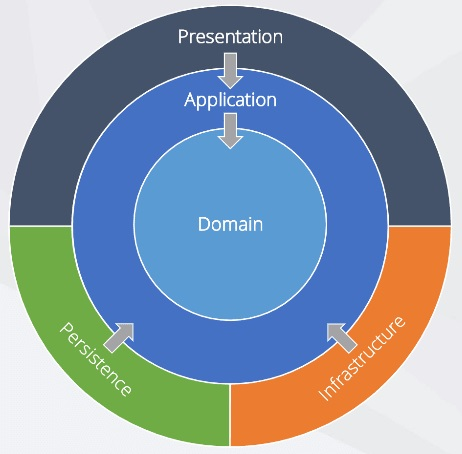

# InfoTrack
## TO RUN
Open the InfoTrack sln, build and run. 
Should be running on IIS Express - http://localhost:62077/

Navigate to folder repos\InfoTrack\InfoTrack.UI
Open cmd. Enter command 'npm install'. Enter command 'npm start'.

Ensure baseUrl in InfoTrackClient.js client is http://localhost:62077.

## TECH
* .NET Core 3.1
* MediatR
* XUnit
* Moq

## ARCHITECTURE
CQRS with onion architecture

### Domain 
This project contains all entities relating to the domain.

### Application 
This project contains the business logic. 

### Infrastructure 
This project contains the implementation of web services and parser logic.

### API 
Contains controllers and middleware setup.

### Dependencies 
The project is based on onion architecture - Inner layers of the below diagram should not reference outer layers.

